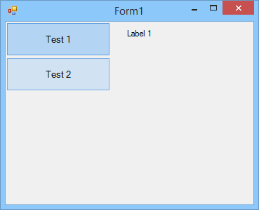

# ListBoxTabs
ListBoxTabs is a fancier replacement for the C# TabControl. It was created mostly for personal use, so if you want to fix anything, go ahead and make a pull request.

LBT is a custom UserControl containing a ListBox control. The ListBox control's items are drawn manually to allow for custom colors and borders. Items will change color when the mouse cursor is hovering over them.



## Install via NuGet
You can install the NuGet package either through Visual Studio or by running this command:

    PM>Install-Package ListBoxTabs

## Using the Control
### Accessing the Underlying ListBox
You can access the underlying ListBox by using `listBoxTabs1.ListBox`; from there, you can assign the ListBox's properties or add event handlers. Unfortunately, the ListBox's properties *must* be changed programmatically (unless you can figure out how to make the ListBox browsable and change its propreties from there).

### Properties

#### General Properties
* **BorderOffset**: Gets or sets the offset for each ListBox item from its normal border (Minimum value: 1; Default value: 5)
* **BackColor** (*Overridden*): Gets or sets the BackColor of both the UserControl and the underlying ListBox.
* **ForeColor** (*Overridden*): Gets or sets the ForeColor of both the UserControl and the underlying ListBox.
* **Font** (*Overridden*): Gets or sets the font of both the UserControl and the underlying ListBox.

#### Unselected Item Properties
* **UnselectedBorderColor**: Gets or sets the border color for unselected ListBox items. (Default value: `SystemColors.Window`)
* **UnselectedBackColor**: Gets or sets the BackColor for unselected ListBox items. (Default value: `SystemColors.Window`)
* **UnselectedForeColor**: Gets or sets the ForeColor for unselected ListBox items. (Default value: `SystemColors.WindowText`)

#### Selected Item Properties
* **SelectedBorderColor**: Gets or sets the border color for selected ListBox items. (Default value: `Color.FromArgb(255, 96, 161, 226)`)
* **SelectedBackColor**: Gets or sets the BackColor for selected ListBox items. (Default value: `Color.FromArgb(255, 180, 212, 244)`)
* **SelectedForeColor**: Gets or sets the ForeColor for selected ListBox items. (Default value: `SystemColors.WindowText`)

#### Hovered Item Properties
* **HoverBorderColor**: Gets or sets the border color for hovered-over ListBox items. (Default value: `Color.FromArgb(255, 120, 174, 229)`)
* **HoverBackColor**: Gets or sets the BackColor for hovered-over ListBox items. (Default value: `Color.FromArgb(255, 209, 226, 242)`)
* **HoverForeColor**: Gets or sets the ForeColor for hovered-over ListBox items. (Default value: `SystemColors.WindowText`)

## Examples
### Adding Items to the ListBox

```C#
private void Form1_Load(object sender, EventArgs e) {
	listBoxTabs1.ListBox.Items.Add("Test 1");
	listBoxTabs1.ListBox.Items.Add("Test 2");
	listBoxTabs1.ListBox.Items.Add("Test 3");
	listBoxTabs1.ListBox.Items.Add("Test 4");
	listBoxTabs1.ListBox.Items.Add("Test 5");
}
```

### Handling SelectedIndexChanged

```C#
private void Form1_Load(object sender, EventArgs e) {
	listBoxTabs.ListBox.SelectedIndexChanged += ListBox_SelectedIndexChanged;
	
	listBoxTabs1.ListBox.Items.Add("Test 1");
	listBoxTabs1.ListBox.Items.Add("Test 2");
	
	CreateControls();
	
	// set the index to the first entry
	listBoxTabs.ListBox.SelectedIndex = 0;
}

private void ListBox_SelectedIndexChanged(object sender, EventArgs e) {
    switch(listBoxTabs1.ListBox.SelectedIndex) {
		case 0: // First index
			FirstFunction();
			break;
		case 1: // Second index
			SecondFunction();
			break;
	}
}

private void CreateControls() {
    Label label = new Label();
    label.Text = "First function executed!";
    label.Name = "firstFunction";
    this.Controls.Add(label);
    
    Label label = new Label();
    label.Text = "Second function executed!";
    label.Name = "secondFunction";
    this.Controls.Add(label);
}

private void FirstFunction() {
    if(this.Controls.Count > 0) {
        // hides all the existing controls to make way for new ones
        foreach(Control c in this.Controls) {
            c.Hide();
        }
    }
    
    // some LINQ stuff to show the control
    this.Controls.First(c => c.Name == "firstFunction")).Show();
}

private void SecondFunction() {
    if(this.Controls.Count > 0) {
        // hides all the existing controls to make way for new ones
        foreach(Control c in this.Controls) {
            c.Hide();
        }
    }
    
    // some LINQ stuff to show the control
    this.Controls.First(c => c.Name == "secondFunction")).Show();
}
```

### Hiding the Background for Unselected Items
```C#
private void Form1_Load(object sender, EventArgs e) {
    // sets the BackColor of the ListBoxTabs control to the form's BackColor
    listBox1.BackColor = this.BackColor;
    // then sets the UnselectedBorderColor and UnselectedBackColor
    // to the ListBoxTabs' BackColor so it matches
    listBox1.ListBox.UnselectedBorderColor = listBox1.BackColor;
    listBox1.ListBox.UnselectedBackColor = listBox1.BackColor;
    
    // NOTE: Transparent will not work! That will stop the unselected
    // items from changing color at all!
}
```
